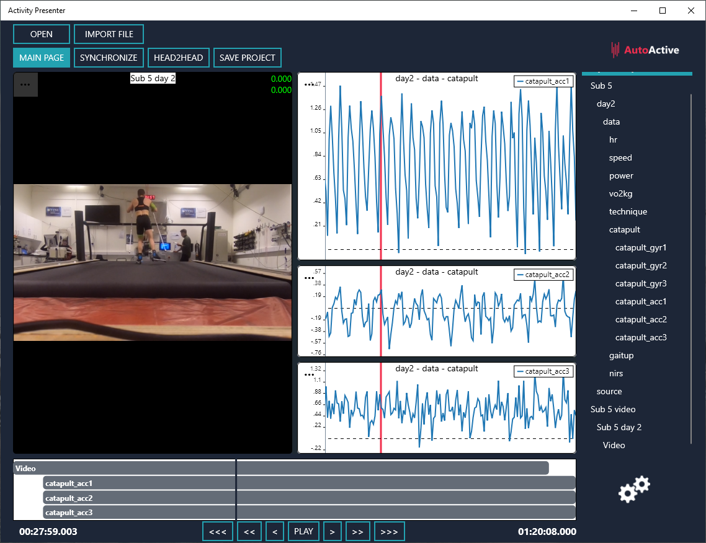
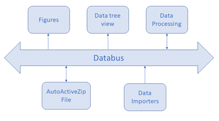
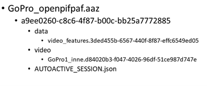
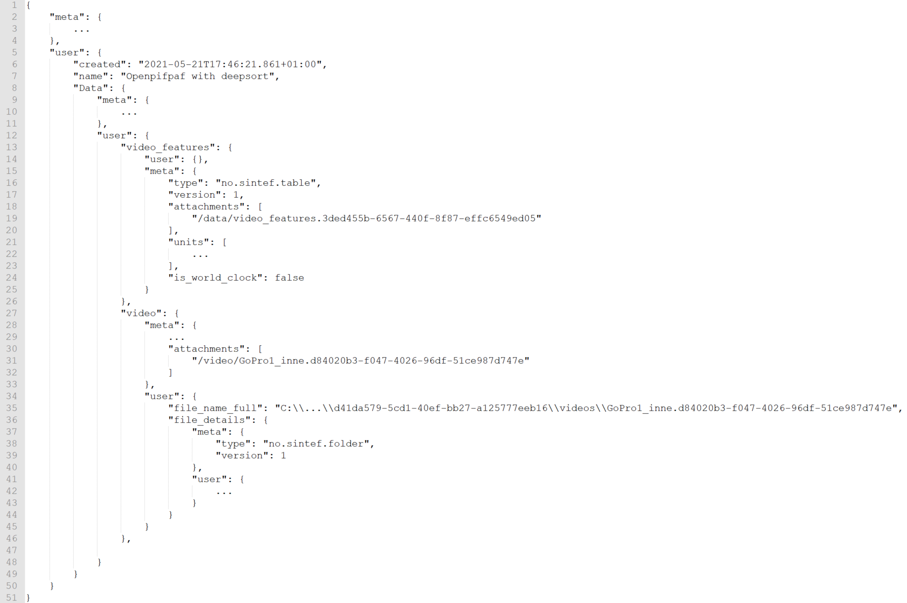

# Statement of Need

There is an ever-growing variety of biomedical sensors and wearables that aim to monitor activity, 
biomarkers, and vital signs. However, to fully understand the physical and physiological factors of 
the underlying processes, multiple sensors are often needed in combination with videos. Software for 
combining, synchronizing, organising and processing sensor data from multiple sensors and videos is 
therefore essential. Even though multiple open-source solutions like Pyomeca [@Martinez2020] and 
ALPS [@Musmann2020] exist, existing open source software solutions are limited. None provide the possibility to 
combine sensor data and videos, few provide tools for synchronising sensors, and none provide tools 
for synchronising sensors with videos. Furthermore, many solutions rely on cloud storage, which is 
often unacceptable in biomedical research. There also exist solutions which are not limited in 
functionality and solve many of the same problems as ARE, such as SensiML Analytics Toolkit [@SensiML] 
and Pasco Capstone Software [@PascoSoftware], but these are not open source. To meet these limitations, 
we have developed the AutoActive Research Environment (ARE). The idea of ARE is to create a generic 
open source methodological framework, especially but not exlusively for the biomedical and sport
domains, supporting a wide range of sensors and tools that aid the development, optimization, and
evaluation of algorithms.

# Summary

ARE consists of three different software modules; ActivityPresenter, a Matlab toolbox, and 
a Python toolbox. ActivityPresenter is created to simplify the process of visualising, 
synchronising, and organising data, such as sensor data and videos from multiple sources, while the 
Matlab and Python toolboxes allow researchers to easily process data. Furthermore, a file format called 
AutoActiveZip (aaz) was created to store data and metadata in an organized manner. This format is a 
structured archive which contains immutable data structures and where the information within can be 
accessed without the use of temporary files that needs to be cleaned up. This ensures that sensitive 
data are not inadvertently left in temporary folders in case of program failure. The format allows the 
strengths of ActivityPresenter, such as synchronising data from multiple sources, and visualising 
videos and sensor data side by side to be combined with algorithms developed in Matlab and Python. 

# Overview of the AutoActive Research Environment

## ActivityPresenter

ActivityPresenter is an easy-to-use software with a graphical user interface that can visualise, 
synchronise, and organise data from sensors and cameras. It is developed using the Xamarin framework 
which simplifies the task of supporting multiple operating systems, as almost all the code for both the 
GUI and data handling can be shared for all targeted platforms. An example of ActivityPresenter can be 
seen in \autoref{fig:ActivityPresenter} where we visualise synchronised video with gyroscope and heart 
rate data. 

ActivityPresenter makes it possible to import data from an aaz file, files generated by sensors such as 
the Physiolog 5 sensor (Gait Up SA, Lausanne, Switzerland), Catapult Optimeye S5 
(Catapult Sports, Melbourne, Australia) and tcx files from Garmin (Garmin International Inc, Kansas, USA) 
as well as common data types such as csv and xlsx and all video formats acceptable 
by Microsoft Windows. Furthermore, it is easy to extend accepted file types as the architecture is 
plugin-based. The application architecture can be seen in \autoref{fig:Architecture}. Data can be loaded from an aaz file 
or from a custom data importer onto the databus. Data on the databus can be used to create tree views 
to get an overview of the datasets, create figures to view data, or synchronise data coming from 
different sources. When the data has been synchronised, the changes are written back to the databus. 
The data on the databus can also be reorganised and written to a new aaz file. When data is made 
available on the databus, data is not necessarily loaded into memory. If data comes from an aaz file, 
data is first read into memory when accessed. This typically happens when the data is selected from 
the data tree view for visualization. Hereby, we minimise the memory footprint of ActivityPresenter 
and make it possible to view parts of large sessions on devices with limited resources. 

## Data Handling

### Session 

The concept of sessions is key to how we handle and store data in ARE; they are the root containers of
datasets. A session represents an activity bounded in time and space and stores the information about
the context of the activity, and the data generated during that activity. When a session is saved, it
becomes immutable and is assigned a unique identifier. This allow sessions to be based on previous
sessions, and enables traceability and reproducibility as analysed information is referenced to the
session where the data for that analysis was stored. It also allows referencing of large files, such as
high-quality video captures during an activity, without duplicating the files.

### AutoActiveZip File

An AutoActiveZip (aaz) file is an uncompressed zip archive that contains a set of sessions. All 
information inside the archive is organized into directories like a file system. By using the ZIP archive 
file format, we can store multiple datasets in a single file, store necessary metadata to describe the 
data, but most importantly we can compress data in a binary format suitable for different data types. In 
ARE sensor data is stored in parquet files, while videos are stored in their original format, as they are 
already compressed. By using the parquet format instead of a common data format such as csv we reduce 
storage requirements on larger files. The necessary metadata is stored in a json file within the archive. 
An example of the structure of an aaz-file can be seen in \autoref{fig:AazFile} where a file named "GoPro\_openpifpaf.aaz" 
is described. An aaz file can contain one to many sessions, in this case there is only one session. The 
session is identified with a uuid4 number, "a9ee0260-c8c6-4f87-b00c-bb25a7772885" and is just a folder. 
Inside the session folder two more folders exist, a folder named "data" and a folder named "video", and a 
json file named "AUTOACTIVE\_SESSION.json". The purpose of the json file is to store necessary metadata. The 
folder named data contains a parquet file named "video\_features.3ded455b-6567-440f-8f87-effc6549ed05". The 
other folder contains a video named "GoPro1\_inne.d84020b3-f047-4026-96df-51ce987d747e". Although the folders 
only contain one file in the example, a folder can potentially contain multiple different files. 

### Json file

Each session in an aaz file contains a root json file which contains important metadata used when reading 
data from the aaz file into native C#, Matlab and Python classes. An example of the structure of a json 
file can be seen in \autoref{fig:JsonFile}. The json file corresponds to the zip file in \autoref{fig:AazFile}. 
Each part of the json file contains a meta field and a user field. The meta field contains only data not 
presented to the user, while the user field contains metadata visible and editable by user or nested datasets in the form 
of other data objects. The first meta field seen in \autoref{fig:JsonFile} describes the session object while the user 
field contains another folder named "Data" where the data-table and video is defined. 

## Matlab and Python toolboxes

The Matlab and Python toolboxes consist of a reader and writer class which reads and writes AutoActiveZip 
files. The Matlab toolbox also consists of classes which makes it easy to create aaz dataobjects directly 
from e.g. Physiolog 5 and tcx files from Garmin. Furthermore, the libraries consist of a set of classes storing 
sensor data and videos. The data classes all inherit from the dataobject class. The dataobject class specifies 
all transformations needed for converting the native Matlab and Python formats to and from the AutoActiveZip 
file. All dataobject sub-classes in Matlab and Python are identified by a type string. The type string is also 
stored in the AutoActiveZip File in the json file and can be seen in the meta sections in \autoref{fig:JsonFile}. This makes 
it possible to load a session from the AutoActiveZip into specific data classes.

# Acknowledgements

The AutoActive Research platform was developed at SINTEF as a part of the AutoActive, project financed by the 
Norwegian Research Council (no. 270791), with support from the SILENSE ARTEMIS project (no. 737487) and 
internal funding.

# References
